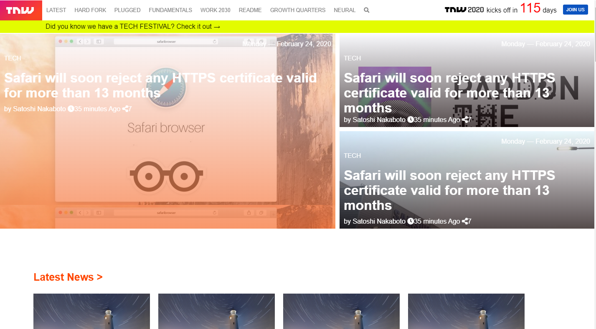

# Building-with-Responsive-Design
This project consists of replicating the The Next Web website putting emphasis on how it behaves differently depending on the size of the screen where the website is rendered.

## Built With

- HTML and CSS,

## Live Demo

[Live Demo Link](https://rawcdn.githack.com/adamclasic/Building-with-Responsive-Design/e4e500b6f7aedf4ac130c87e1591c22a6162ea6a/index.html)

## Authors

👤 **Adam Allalou**
- Github: [@adamclasic](https://github.com/adamclasic)

👤 **Maurice Murangwa**

- Github: [@Morrism1](https://github.com/Morrism1)
- Twitter: [@MorrisMontana0](https://twitter.com/MorrisMontana0)
- Linkedin: [Maurice Murangwa](https://www.linkedin.com/in/murangwa-maurice-769549140/)

## 🤝 Contributing

Contributions, issues and feature requests are welcome!

Feel free to check the [issues page](issues/).

## Show your support

Give a ⭐️ if you like this project!

## 📝 License

This project is [MIT](lic.url) licensed.

